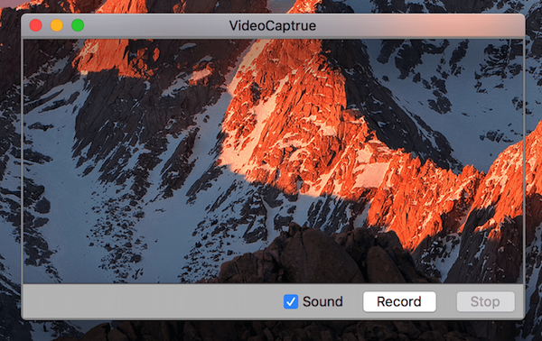

# ScreenRecord  


 


A Swift framework to easily record the screen on OS X.

## Install
 
You can just put [ScreenRecord.swift](https://github.com/KrisYu/ScreenRecord/blob/master/ScreenRecord/ScreenRecord.swift) in your Project and use the public methods or Carthage/CocoaPods.


### Carthage

`github "KrisYu/ScreenRecord"`


### Cocoapods

`pod "ScreenRecord"`


## Demo

Download this repo and check VideoCapture.

It is a video capture app imitate [GifCaptrue](https://github.com/onmyway133/GifCapture).


 


## QuickStart

```swift

let recorder = try? ScreenRecord.Recorder(destination: url, displayId: CGMainDisplayID(), cropRect: nil, audioDevice: nil )

recorder?.start()

recorder?.stop()
```

## Notice

`recorder.start()/stop()` use the `startRunning()/stopRunning()` function from AVCaptureSession. You need to consider it may block the UI / take some time.
